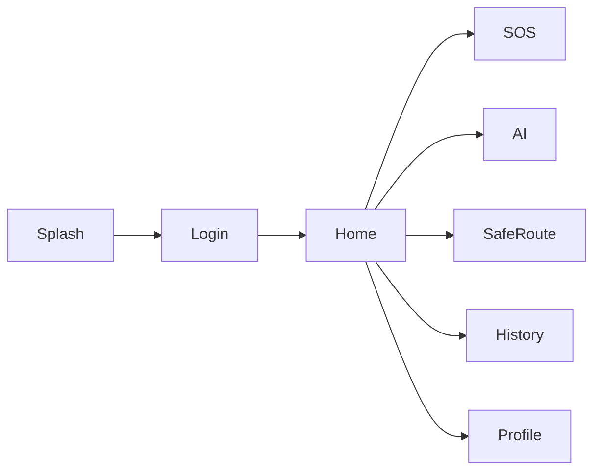

# 📋 Business Requirements Document (BRD)

# GuardianAI - AI Powered Women's Safety App (Frontend Prototype)

> Version: 1.0
> Project Phase: Frontend/UI Prototype
> Platform: Android (React Native + Expo)

---

# 📌 Project Overview

GuardianAI is a modern mobile application designed to enhance women's safety through an intuitive, intelligent, and user-friendly interface.

This phase focuses exclusively on designing the application's frontend experience, allowing users to explore the complete safety workflow before backend and AI integration.

The UI demonstrates how users will interact with emergency features, AI insights, safe route recommendations, and travel monitoring.

---

# 🎯 Problem Statement

Most existing safety applications have outdated interfaces, complicated navigation, and require multiple interactions during emergencies.

In stressful situations, users need an interface that is:

- Fast
- Easy to understand
- Minimal
- Visually clear
- Accessible with one hand

GuardianAI aims to provide a clean, modern, and user-centric interface that enables users to access critical safety features within seconds.

---

# 🎯 Project Objectives

The frontend prototype aims to:

- Design an intuitive mobile interface.
- Reduce user interaction during emergencies.
- Create an attractive modern UI.
- Demonstrate the complete user journey.
- Showcase AI-powered safety features visually.
- Build reusable UI components.
- Prepare the application for backend integration.

---

# 👥 Target Users

Primary Users

- Women
- College Students
- Working Professionals
- Solo Travelers

Secondary Users

- Parents
- Family Members
- Hostel Wardens

---

# 📱 Core UI Features

## Smart SOS

A large emergency button allows users to trigger an SOS with a single tap.

UI includes:

- Emergency countdown
- SOS animation
- Success confirmation

---

## AI Twin Dashboard

Displays:

- Daily routine
- AI Risk Score
- Behaviour Summary
- Travel Insights

(Mock Data)

---

## Route Deviation

Displays warning screen when the user leaves the normal route.

Includes

- Alert Card
- Risk Level
- Action Buttons

---

## Safe Route

Users can

- Search destination
- Compare routes
- View Safety Score
- See nearby emergency services

(Mock Map)

---

## Profile

Users can

- Edit Profile
- View Trusted Contacts
- Manage Settings

---

# 📱 Screen List

- Splash Screen
- Login
- Signup
- Permissions
- Home Dashboard
- AI Twin
- Safe Route
- Route Alert
- Emergency Countdown
- Emergency Active
- History
- Profile
- Settings

---

# 🎨 UI Goals

The interface should be

- Clean
- Modern
- Professional
- Minimal
- Premium
- Easy to navigate
- Accessible

---

# 🎨 Design Principles

## Simplicity

Users should reach important features within one or two taps.

---

## Accessibility

- Large touch targets
- High contrast
- Readable typography

---

## Consistency

Use the same

- Colors
- Icons
- Cards
- Buttons
- Spacing

throughout the application.

---

## Emergency First

The SOS button should always be visible and easily accessible.

---

# 🚶 User Journey

---

# 🎨 Design Language

Inspired by

- Material 3
- Apple Health
- Google Maps

Light Theme Only

---

# 📊 Success Criteria

The prototype will be considered successful if users can:

- Navigate all screens easily.
- Trigger SOS within one tap.
- Understand AI insights quickly.
- Find Safe Route easily.
- Complete common tasks without confusion.

---

# 🚀 Future Scope

Future versions will include:

- Backend integration
- AI Digital Twin
- GPS Tracking
- Offline Support
- Route Learning
- Risk Prediction
- Emergency Notifications

---

# 📌 Deliverables

- Complete React Native UI
- Responsive Design
- Navigation
- Component Library
- Design System
- Mock Data
- Interactive Prototype

---

# 📖 Conclusion

GuardianAI's frontend prototype demonstrates a modern and user-friendly safety application focused on simplicity, accessibility, and trust. The UI is designed to provide an intuitive experience while serving as the foundation for future AI and backend implementation.