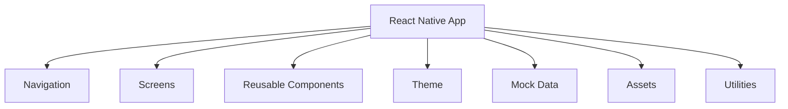
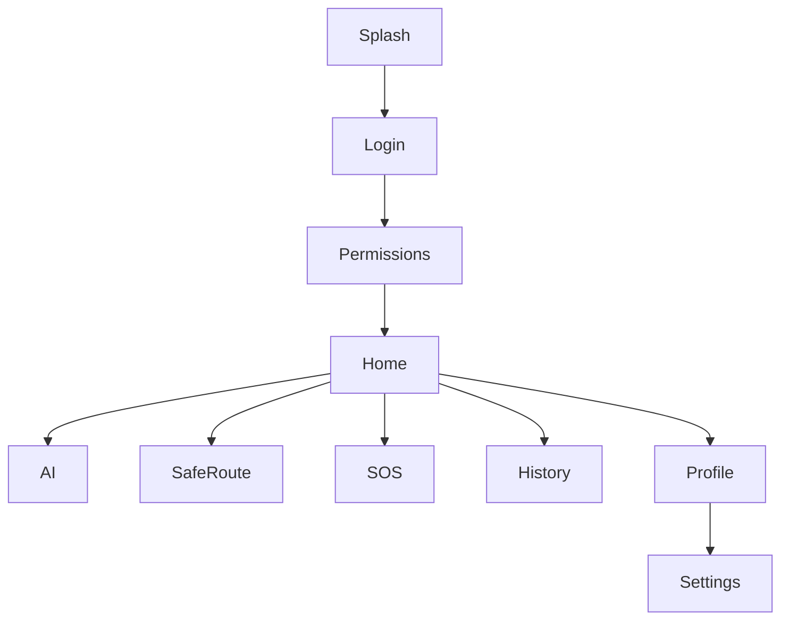
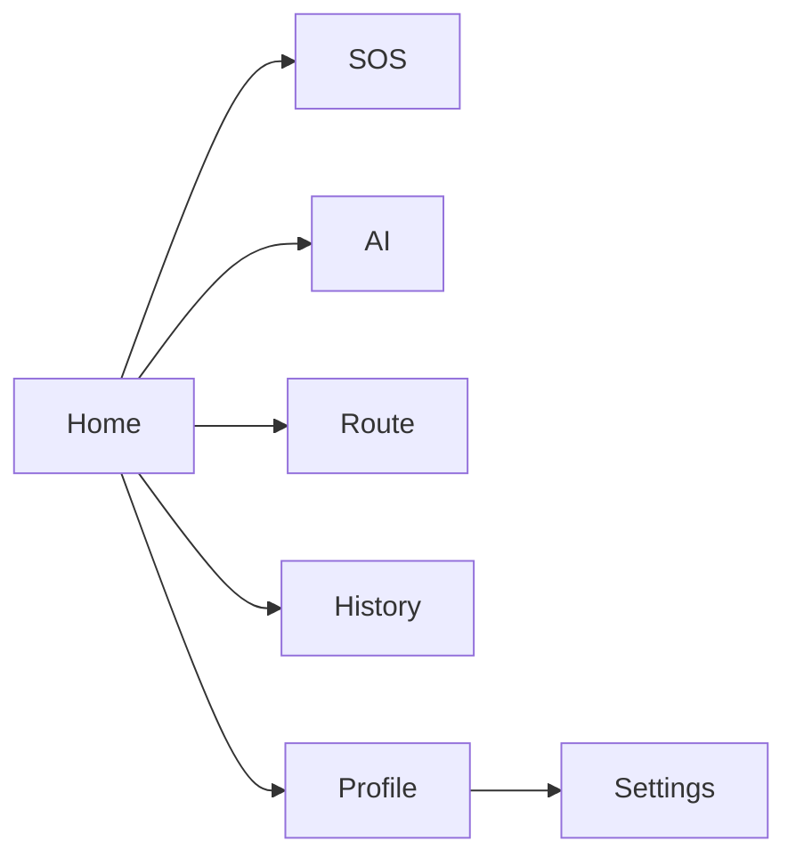

 
# 🏗️ Frontend Architecture

# GuardianAI – React Native Frontend Architecture

> **Project:** GuardianAI  
> **Version:** 1.0  
> **Platform:** Android (React Native + Expo)  
> **Architecture:** Feature-Based Architecture

---

# 📌 Overview

GuardianAI follows a **Feature-Based Frontend Architecture**, making the project scalable, maintainable, and easy to extend.

The frontend is responsible for:

- Displaying all UI screens
- Managing navigation
- Handling user interactions
- Managing local UI state
- Displaying mock data during the prototype phase
- Preparing the application for future backend integration

Since this is the **UI Prototype**, no real API calls or database interactions are implemented.

---

# 🎯 Architecture Goals

The architecture is designed to be:

- Modular
- Reusable
- Scalable
- Maintainable
- Clean
- Easy to understand
- Production-ready

---

# 🏛 Architecture Overview



---


# 📱 Screen Architecture

GuardianAI consists of the following primary screens.

```
Splash

↓

Login

↓

Permissions

↓

Home

├── AI Twin

├── Safe Route

├── SOS

├── History

├── Profile

└── Settings
```

---

# 🧭 Navigation Architecture

GuardianAI uses **React Navigation**.



---

# 📦 Component Architecture

Reusable components are organized independently.

```
Components

├── Button

├── Card

├── Badge

├── Avatar

├── Search Bar

├── Risk Indicator

├── Progress Ring

├── Bottom Navigation

├── Header

├── AI Insight Card

├── Route Card

├── SOS Button

└── Status Card
```

Each component should have a **single responsibility** and be reusable across multiple screens.

---

# 🧩 Feature Modules

Each feature is developed independently.

## 1. Authentication

Screens

- Login
- Signup

Components

- Input
- Button
- Logo

---

## 2. Home

Components

- Greeting Card
- SOS Button
- AI Card
- Quick Actions
- Bottom Navigation

---

## 3. AI Twin

Components

- Timeline Card
- Behaviour Card
- Risk Score
- Weekly Activity
- AI Insight

---

## 4. Safe Route

Components

- Search Box
- Map Placeholder
- Route Card
- Safety Score
- Nearby Places Card

---

## 5. Route Deviation

Components

- Alert Card
- Warning Icon
- Confirmation Buttons

---

## 6. History

Components

- History Card
- Status Badge
- Filter Chips

---

## 7. Profile

Components

- User Card
- Settings List
- Logout Button

---

# 🎨 Theme Architecture

The application follows a centralized theme system.

```
Theme

Colors

Typography

Spacing

Radius

Shadow

Icons
```

Every screen imports values from the theme instead of hardcoding styles.

Example:

```tsx
backgroundColor = Colors.background

borderRadius = Radius.large

padding = Spacing.md
```

---

# 🗂 Asset Management

Assets are organized separately.

```
Assets

Icons

Illustrations

Images

Fonts

Animations
```

Examples

```
logo.png

sos.png

safeRoute.png

aiTwin.png

avatar.png
```

---

# 📊 Mock Data Architecture

During UI development all screens use local mock data.

```
User

↓

Trips

↓

Risk Score

↓

Notifications

↓

History

↓

Safe Routes
```

Example

```ts
User

Name

Sarah Johnson

Risk Score

12

Status

Safe

Today's Route

Home → College
```

---

# 🔁 State Management

Current Phase

React Hooks

```
useState

useEffect

useMemo
```

Future

React Context

or

Redux Toolkit

---

# 🎯 UI Flow



---

# 📐 Design Principles

The frontend follows:

- Minimal Design
- Material 3
- Consistent Spacing
- Rounded Cards
- Soft Shadows
- Light Theme
- Accessibility First
- Mobile First

---

# 📱 Responsive Design

The UI should support:

- Small Android Devices
- Medium Phones
- Large Phones
- Tablets (Future)

Guidelines

- Flexible layouts
- Percentage-based widths
- Scrollable screens
- Safe Area support

---

# 📦 Reusable UI Components

Every component should be reusable.

Examples

- Primary Button
- Secondary Button
- SOS Button
- Status Badge
- AI Card
- Route Card
- User Card
- Setting Tile
- Progress Ring

---

# 📋 Naming Convention

Folders

```
HomeScreen

ProfileScreen

SafeRouteScreen
```

Components

```
PrimaryButton

AIInsightCard

SOSButton

RouteCard

RiskIndicator
```

Hooks

```
useCountdown

useTheme

useMockLocation
```

---

# 📈 Future Scalability

The architecture is designed to easily support:

- Backend APIs
- Authentication
- SQLite
- AI Engine
- Offline Mode
- Push Notifications
- GPS Tracking
- Maps Integration

without changing the UI structure.

---

# ✅ Frontend Best Practices

- Keep screens lightweight.
- Move reusable UI into components.
- Avoid duplicate code.
- Use centralized theme values.
- Separate business logic from UI.
- Follow consistent naming conventions.
- Use TypeScript where possible.
- Organize code by feature instead of file type.

---

# 📌 Conclusion

The GuardianAI frontend architecture is designed around modularity, reusability, and scalability. A feature-based structure, reusable component library, centralized theme system, and clean navigation flow ensure that the UI remains easy to maintain while providing a solid foundation for future integration of backend services, AI capabilities, and offline functionality.